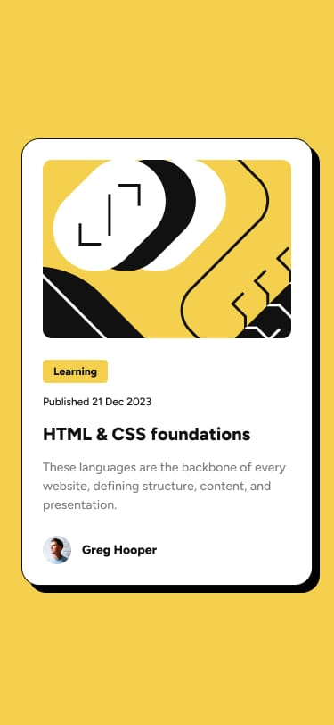

# Frontend Mentor - Blog preview card solution

This is a solution to the [Blog preview card challenge on Frontend Mentor](https://www.frontendmentor.io/challenges/blog-preview-card-ckPaj01IcS). Frontend Mentor challenges help you improve your coding skills by building realistic projects. 

## Table of contents

- [Overview](#overview)
  - [The challenge](#the-challenge)
  - [Screenshot](#screenshot)
  - [Links](#links)
- [My process](#my-process)
  - [Built with](#built-with)
  - [What I learned](#what-i-learned)
  - [Continued development](#continued-development)
  - [Useful resources](#useful-resources)
- [Author](#author)
- [Acknowledgments](#acknowledgments)


## Overview

### The challenge

Users should be able to:

- See hover and focus states for all interactive elements on the page

### Screenshot
<!-- desktop -->

<!-- Mobile -->


### Links

- Solution URL: [FMC code](https://your-solution-url.com](https://www.frontendmentor.io/solutions/flexbox-LtOSCwbJ3x))
- Live Site URL: [blog-preview-card-main](https://blog-preview-card-main2.netlify.app)

## My process

### Built with

- Semantic HTML5 markup
- CSS custom properties
- Flexbox
- Mobile-first workflow
- [SASS/SCSS](https://sass-lang.com/guide/) - For styles


### What I learned

SASS/SCSS Variable and nesting.

To see how you can add code snippets, see below:

```SCSS
// Colors
$primary-color: hsl(47, 88%, 63%);
$neutral-colorWhite: hsl(0, 0%, 100%);
$neutral-colorGrey: hsl(0, 0%, 50%);
$neutral-colorBlack: hsl(0, 0%, 7%);

// Fonts
$font-size: 16px;
$font-weight-sm: 600;
$font-weight-lg: 800;
$font-family: "Figtree", sans-serif;

body{
  background-color: $primary-color;
  font-family: $font-family;
  align-items: center;
  color: $neutral-colorGrey;
}

.center-content{
  background-color: $neutral-colorWhite;
  $neutral-colorBlack;

    // img-card
    .img-card{
      width: 100%;
      img{
        width: 100%;
        margin-bottom: 5px;
        border-radius: 10px;
      }
      button{
      background-color: $primary-color;
      color: $neutral-colorBlack;
      border: none;
      border-radius: 5px;
      font-weight: $font-weight-lg;
      padding: 5px;
      }
    }

    // text-card
    .text-card{
      a{
        text-decoration: none;
        color: $neutral-colorBlack;
        font-weight: $font-weight-lg;
      }
      a:hover{
        color: $primary-color;
      }

      .avatar-img{
        display: flex;
        column-gap: 10px;
        img{
          width: 3rem;
        }
        p{
          color: $neutral-colorBlack;
          font-weight: $font-weight-lg;
        }
      }
    }
}
```


If you want more help with writing markdown, we'd recommend checking out [The Markdown Guide](https://www.markdownguide.org/) to learn more.


### Continued development

👀🧐🥺


### Useful resources

- [SASS guide](https://sass-lang.com/guide/) - This helped me for understanding the syntax very vividly reason.


## Author

- Website - [Victor Maduanusi](https://victormaduanusi.netlify.app/)
- Frontend Mentor - [@therealmaduanusi](https://www.frontendmentor.io/profile/therealmaduanusi)
- Twitter - [@madu_anusi](https://twitter.com/madu_anusi)


## Acknowledgments

Thanks to FMC for providing such work 😊

